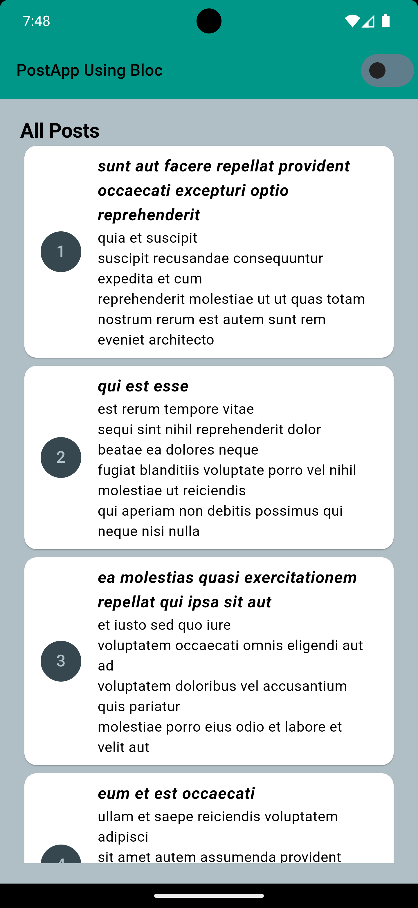
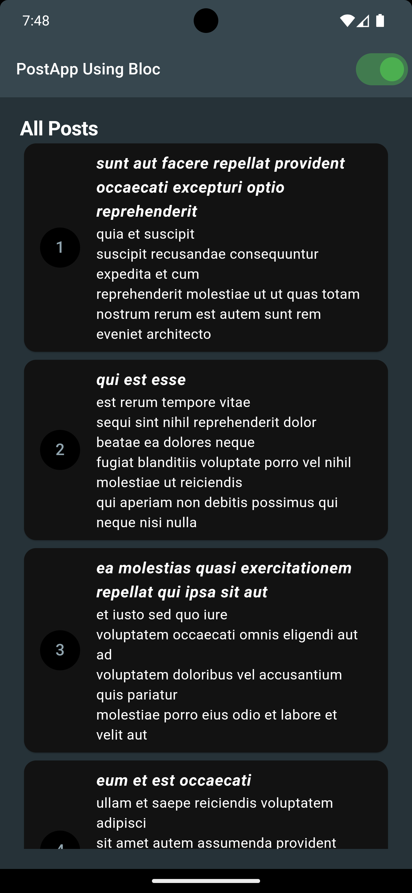

# postblocapp

<h1> A Flutter project.</h1>

A simple Post App Using Flutter.State Management Used Bloc. Api Used jsonplaceholder.A created Theme Change Functionality [Light,Dark]

<h2>ScreenShot</h2>

